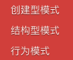

# markdown参考

段落

**加粗**

_斜体_

~~删除线~~

~~**混合使用**~~

`代码 git pull`

[链接](https://www.so.com)

$$a = b$$ 

## 一级标题

### 二级标题

#### 三级标题

* 列表项目1
* 列表项目2
* 列表项目3

1. 列表项目1
2. 列表项目2
3. 列表项目3

* [ ] 任务列表
* [ ] 任务列表2

```text
代码
```

> 引用



| 表格项目1 | 表格项目2 |
| :--- | :--- |
| 项目1内容 | 项目2内容 |
| 项目1内容 | 项目2内容 |


提示






API标题



 desc










desc
















```

```







tab1



tab2



$$
a = b^2
$$



