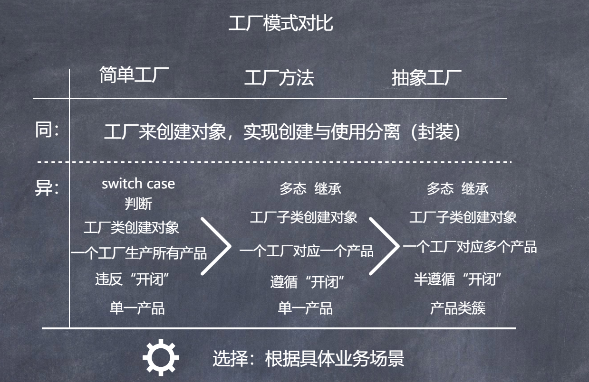
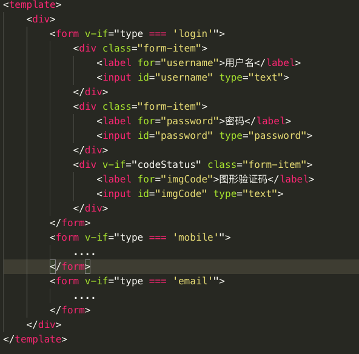
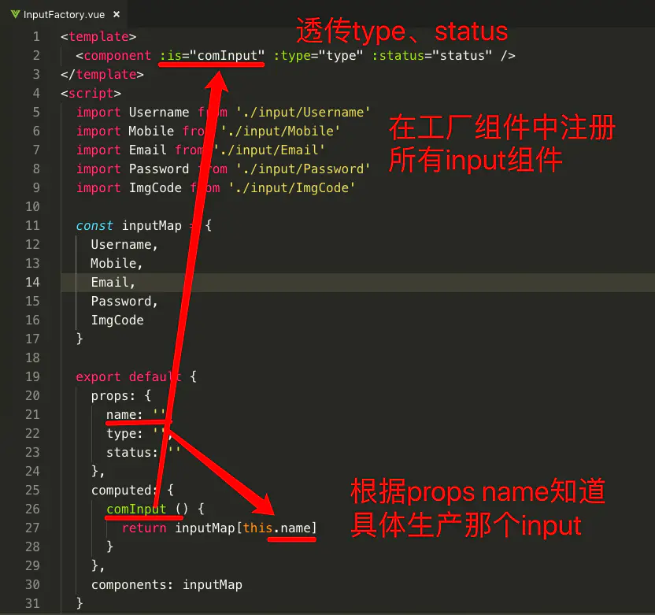
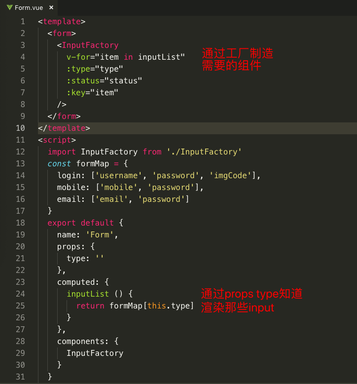

# 抽象工厂模式 Abstract Factory

## 抽象工厂模式

### 特点
> 抽象工厂中每个工厂可以创建多种类的产品；而工厂方法每个工厂只能创建一类

### 缺点
> 当产品族中需要增加一个新的产品时，所有的工厂类都需要进行修改。增加了系统的抽象性和理解难度。违反“开闭原则”

### 优点
> 同工厂方法  +  一个工厂可以创建多种类产品

### 应用场景
> - 一个系统不要求依赖产品类实例如何被创建、组合和表达的表达，这点也是所有工厂模式应用的前提。
> - 这个系统有多个系列产品，而系统中只消费其中某一系列产品
> - 系统要求提供一个产品类的库，所有产品以同样的接口出现，客户端不需要依赖具体实现。

### 代码
[抽象工厂模式示例代码](https://codesandbox.io/s/design-patterns-ih33q?file=/src/abstract_factory/AbstractFactory.ts)

---------

## 工厂模式对比

## 工厂模式应用

### 实例一：jQuery的 $(selector)

    class jQuery {
        constructor(selector) {
            super(selector)
        }
        //  ....
    }

    window.$ = function(selector) {
        return new jQuery(selector)
    }

### 实例二：React 的 createElement()

    React.createElement('h1', null, 'Hello World!')

### 实例三：Vue 的 异步组件 工厂函数

    Vue.component('async-example', 
        function (resolve, reject) {
            setTimeout(function () {
            // 向 `resolve` 回调传递组件定义
            resolve({
                template: '
I am async!
'
            })
            }, 1000)
        }
    )

### 实例四：动态组件

