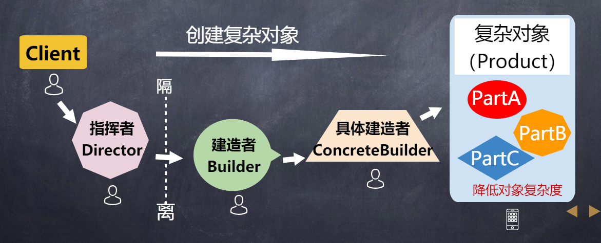
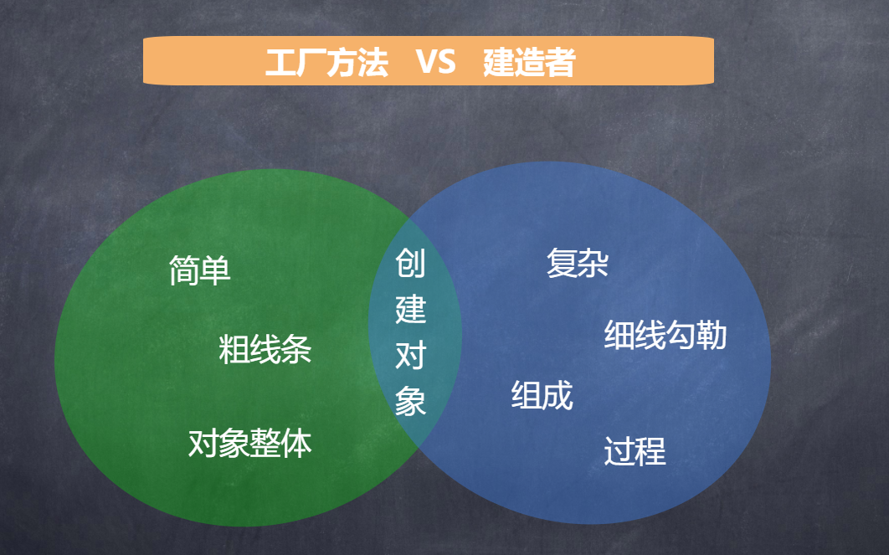

# 建造者模式 Builder

## 建造者

### 特点
> - 指将一个复杂对象的构造与它的表示分离，使同样的构建过程可以创建不同的表示。
> - 建造者模式是一步一步创建一个复杂的对象，它允许用户只通过指定复杂对象的类型和内容就可以构建它们，用户不需要知道内部的具体构建细节
> - > 重点： **复杂对象** **分部（有序/依赖）**  **用户不关注构建细节**

### 理解
> - 复杂对象相当于一辆有待建造的汽车，而对象的属性相当于汽车的部件，建造产品的过程就相当于组合部件的过程。
> - 由于组合部件的过程很复杂，因此，这些部件的组合过程往往被“外部化”到一个称作建造者的对象里。
> - 建造者返还给客户端的是一个已经建造完毕的完整产品对象，而用户无须关心该对象所包含的属性以及它们的组装方式，这就是建造者模式的模式动机。

### 优点
> - 封装性好，构建和表示分离。
> - 扩展性好，各个具体的建造者相互独立，有利于系统的解耦。
> - 客户端不必知道产品内部组成的细节，建造者可以对创建过程逐步细化，而不对其它模块产生任何影响，便于控制细节风险。

### 缺点
> - 产品的组成部分必须相同，这限制了其使用范围。
> - 如果产品的内部变化复杂，如果产品内部发生变化，则建造者也要同步修改，后期维护成本较大。

### 代码
[建造者示例代码](https://codesandbox.io/s/design-patterns-ih33q?file=/src/builder/Builder.ts​​​​​​​)

### 实际应用
> - 建造者模式的目标是减少构造函数所用的参数数量，并提供向对象添加灵活的行为方法。
> - 适用场景：构造函数参数多于4个，部分可选

#### 实例一：jQuery

    $( "<input />" )
    .attr({ "type": "text", "id":"sample"});
    .appendTo("#container");

#### 实例二：Vue3 的 注册组件

    Vue.createApp({})
    .component('SearchInput', SearchInput)
    .directive('focus', FocusDirective)
    .use(LocalePlugin)

#### 实例三
效果

    // 使用建造者模式之前
    const person1 = new Person('Peter', 26, true, 40074986, 4, 2);

    // 使用建造者模式之后
    const person1 = new Person();
    person1
    .name('Peter')
    .age(26)
    .member(true)
    .phone(40074986)
    .children(4)
    .cars(2);

ProductBuilder类

    // 书籍建造者类
    class ProductBuilder {
        constructor() {
            this.name = '';
            this.price = 0;
            this.category = '';
        }

        withName(name) {
            this.name = name
            return this
        }
        withPrice(price) {
            this.price = price
            return this
        }
        withCategory(category) {
            this.category = category
            return this
        }
        build() {
            return {
            name: this.name,
            price: this.price,
            category: this.category,
            }
        }
    }

ProductBuilder类再升级

    class ProductBuilder {
        constructor() {
            this.name = ''
            this.price = ''
            this.category = 'other'

            // 为每个属性生成`wither`
            Object.keys(this).forEach(key => {
            const witherName = `with${key.substring(0, 1).toUpperCase()}${key.substring(1)}`
            this[witherName] = value => {
                this[key] = value
                return this
            }
            })
        }

        build() {
            // 获取此生成器的所有非函数属性的数组
            const keysNoWithers = Object.keys(this).filter(key => typeof this[key] !== 'function')

            return keysNoWithers.reduce((returnValue, key) => {
            return {
                ...returnValue,
                [key]: this[key],
            }
            }, {})
        }
    }

具体实现：提取公共部分到 父类

    class BaseBuilder {
        init() {
            Object.keys(this).forEach((key) => {
            const witherName = `with${key.substring(0,1).toUpperCase()}${key.substring(1)}`;
            this[witherName] = (value) => {
                this[key] = value;
                return this;
            };
            });
        }

        build() {
            const keysNoWithers = Object.keys(this).filter((key) => (
            typeof this[key] !== 'function'
            ));

            return keysNoWithers.reduce((returnValue, key) => {
            return {
                ...returnValue,
                [key]: this[key]
            };
            }, {});
        }
    }

子类

    class ProductBuilder extends BaseBuilder {
        constructor() {
            super();

            this.name = '《前端劝退秘诀》';
            this.price = 9.99;
            this.category = 'other';

            super.init();
        }
    }

调用

    console.log(
        new ProductBuilder()
            .withName('《哈利波特》')
            .withCategory('book')
            .build()
    )

## 建造者 VS 工厂方法
