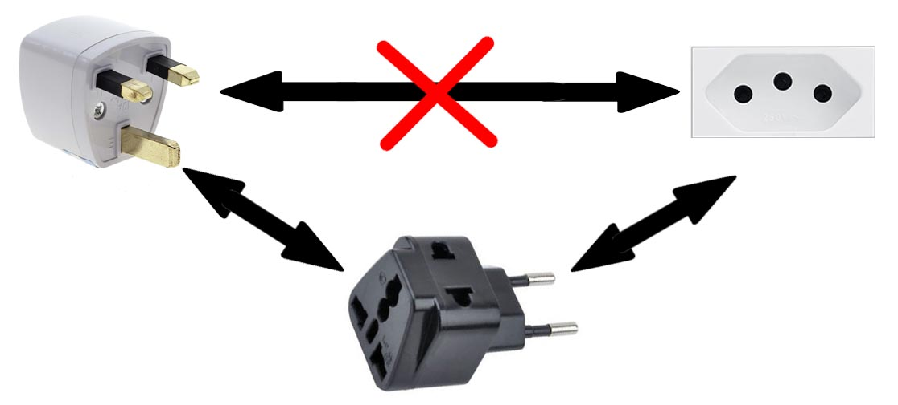

# 适配器模式 Adapter
通过本节的学习，可以了解以下内容：
1. 适配器模式的原理
2. 适配器模式的实现
3. 适配器模式的应用场景

## 回顾一下，创建型模式

我们已经接触过的创建型模式：

* 单例模式：用于创建全局唯一的对象
* 工厂模式：用于创建不同但是相关类型的对象。继承同一父类或者接口的一组子类
* 建造者模式：用于创建复杂对象。可以设置不同的可选参数，“定制化”的创建不同的对象
* 原型模式：对于创建成本比较大的对象，利用对已用对象进行复制的方式进行创建

## 结构型模式

主要总结了一些类和对象组合在一起的经典结构，这些结构可以解决特定用的应用场景的问题。

结构模式有：适配器模式、桥接模式、组合模式，代理模式、装饰器模式、门面模式、享元模式

## 适配器模式的原理

适配器模式就是用来做适配的，通过适配器模式可以将不兼容的接口转换为可兼容的接口。

日常生活中，我们使用的转接头可以更形象的描述适配器模式的原理，如下图国内的插座在国外就不能使用了，但是我们可以通过一个转接头来解决，这个转接头就是一种适配器。



## 适配器模式的结构

适配器模式分为对象适配器和类适配器。

### 对象适配器

适配器将接入的（或现存的）不能直接使用的对象封装成可以使用的接口。所有流行的编程语言都可以实现对象适配器。


* Client 客户端，包含当前程序业务逻辑的类
* Client Interface 客户端接口，描述了其他类与客户端代码合作时必须遵循的协议。
* Service 服务中有一些功能类（通常来自第三方或遗留系统）。客户端与其接口不兼容，因此无法直接调用其功能。
* Adapter 适配器，可以同时与客户端和服务交互的类；它在实现客户端接口的同时封装了服务对象。适配器接受客户端通过适配器接口发起的调用，并将其转换为适用于被封装服务对象的调用。

客户端代码只需通过接口与适配器交互即可， 无需与具体的适配器类耦合。 因此， 你可以向程序中添加新类型的适配器而无需修改已有代码。 这在服务类的接口被更改或替换时很有用： 你无需修改客户端代码就可以创建新的适配器类。

```javascript
// 客户端接口
interface Target {
    f1():void;
    f2():void;
    fc():void;
}
// Service 服务
class Adaptee {
    constructor(){}
    public fa():void {
        console.log("服务：a");
    }
    public fb():void {
        console.log("服务：b");
    }
    public fc():void {
        console.log("服务：c");
    }
}
// 适配器
class Adapter implements Target {
    private adaptee: Adaptee;
    constructor(adaptee: Adaptee) {
        this.adaptee = adaptee;
    }
    public f1(): void {
        this.adaptee.fa();
    }
    public f2(): void {
        // 重新实现
        console.log("对象适配器:222");
    }
    public fc(): void {
        this.adaptee.fc();
    }
}
// 使用
const target: Target = new Adapter(new Adaptee());

target.f1(); // 服务：a
target.f2(); // 对象适配器:222
target.fc(); // 服务：c
```

### 类适配器

适配器同时继承两个对象的接口。这种方式仅能在支持多重继承的编程语言中实现。


类适配器不需要封装任何对象，因为它同时继承了客户端和服务的行为。适配的功能在重写的方法中完成。最后生成的适配器可替代已有的客户端类进行使用。

```javascript
// 客户端接口
interface Target {
    f1():void;
    f2():void;
    fc():void;
}

// service 服务
class Adaptee {
    constructor() {}
    public fa(): void {
        console.log("服务：a");
    }
    public fb(): void {
        console.log("服务：b");
    }
    public fc(): void {
        console.log("服务：c");
    }
}

// 适配器
class Adapter extends Adaptee implements Target  {
    constructor() {
        super();
    }
    public f1():void {
        super.fa();
    }
    public f2():void {
        // 重新实现
        console.log("类适配器：222");
    }
}
const target:Target = new Adapter();

target.f1(); // 服务：a
target.f2(); // 类适配器:222
target.fc(); // 服务：c
```

## 适配器模式的应用场景

### 应用场景之一：封装有缺陷的接口设计


```javascript
// 客户端接口
class Target {
    public request(): string {
        return '默认的客户端方法request';
    }
}

// service 服务
class Adaptee {
    public specificRequest(): string {
        return '.eetpadA eht fo roivaheb laicepS';
    }
}

// 适配器
class Adapter extends Target {
    private adaptee: Adaptee;
    constructor(adaptee: Adaptee) {
        super();
        this.adaptee = adaptee;
    }
    // 复写request方法
    public request(): string {
        const result = this.adaptee.specificRequest().split("").reverse().join("");
        return `复写的客户端request方法. Adapter: (TRANSLATED) ${result}`;
    }
}

// 客户端
function clientCode(target: Target) {
    console.log(target.request());
}

console.log("客户端：可以很好地使用Target对象：");
const target = new Target();
clientCode(target); // 默认的客户端方法request方法

const adaptee = new Adaptee();
console.log("客户端：Adaptee类有一个奇怪的接口");
console.log(`Adaptee: ${adaptee.specificRequest()}`);

const adapter = new Adapter(adaptee);
clientCode(adapter); // 复写的客户端request方法. Adapter: (TRANSLATED) Special behavior of the Adaptee.
```

### 应用场景之二：统一多个类的接口设计

有一个系统要对用户输入的文本内容做敏感词过滤，为提高过滤的覆盖率引入了多款第三方敏感词过滤系统，依次对用户输入的内容进行过滤。但是每个过滤系统提供的接口都不同，这就意味着没法复用一套逻辑来调用各个系统。这时就可以使用适配器模式。

```javascript
// A敏感词过滤系统提供的接口
class ASensitiveWordsFilter {
  public filterSexyWords(text: string): string {
    return `A接口过滤性敏感词${text}--`;
  }
  public filterPoliticalWords(text: string): string {
    return `A接口过滤政治敏感词${text}--`;
  }
}

// B敏感词过滤系统提供的接口
class BSensitiveWordsFilter {
  public filter(text: string): string {
    return `B接口过滤敏感词${text}--`;
  }
}

// C敏感词过滤系统提供的接口
class CSensitiveWordsFilter {
  public filter(text: string, mask: string): string {
    return `C接口过滤敏感词${text}${mask}--`;
  }
}

```
未使用适配器模式时：

```javascript
class RiskManagement {
    private aFilter: ASensitiveWordsFilter = new ASensitiveWordsFilter();
    private bFilter: BSensitiveWordsFilter = new BSensitiveWordsFilter();
    private cFilter: CSensitiveWordsFilter = new CSensitiveWordsFilter();

    public filterSensitiveWords(text: string): string {
        let maskedText = this.aFilter.filterSexyWords(text);
            maskedText = this.aFilter.filterPoliticalWords(maskedText);
            maskedText = this.bFilter.filter(maskedText);
            maskedText = this.cFilter.filter(maskedText, "***");
        return maskedText;
    }
}
const riskmanagement = new RiskManagement();
const filterResult = riskmanagement.filterSensitiveWords("test");
console.log(filterResult); // C接口过滤敏感词B接口过滤敏感词A接口过滤政治敏感词A接口过滤性敏感词test------***--
```
使用适配器模式后：

```javascript
// 客户端接口
interface ISensitiveWordsFilter {
  filter(text: string, mask?: string): string;
}
// A接口适配器
class ASensitiveWordsFilterAdaptor implements ISensitiveWordsFilter {
  private aFilter: ASensitiveWordsFilter = new ASensitiveWordsFilter();
  public filter(text: string): string {
    let maskedText: string = this.aFilter.filterSexyWords(text);
        maskedText = this.aFilter.filterPoliticalWords(maskedText);
    return maskedText;
  }
}
// B接口适配器
class BSensitiveWordsFilterAdaptor implements ISensitiveWordsFilter {
  private bFilter: BSensitiveWordsFilter = new BSensitiveWordsFilter();
  public filter(text: string): string {
    let maskedText: string = this.bFilter.filter(text);
    return maskedText;
  }
}
// C接口适配器
class CSensitiveWordsFilterAdaptor implements ISensitiveWordsFilter {
  private cFilter: CSensitiveWordsFilter = new CSensitiveWordsFilter();
  public filter(text: string, mask: string) {
    let maskedText: string = this.cFilter.filter(text, mask);
    return maskedText;
  }
}

class RiskManagement {
  private filters: ISensitiveWordsFilter[] = new Array();

  public addSensitiveWordsFilter(filter: ISensitiveWordsFilter): void {
    this.filters.push(filter);
  }

  public filterSensitiveWords(text: string, mask: string) {
    let maskedText: string = text;
    this.filters.forEach((filter) => {
      console.log(`before:${maskedText}`);
      maskedText = filter.filter(maskedText, mask);
      console.log(`after:${maskedText}`);
    });
    return maskedText;
  }
}

const riskmanagement = new RiskManagement();

riskmanagement.addSensitiveWordsFilter(new ASensitiveWordsFilterAdaptor());
riskmanagement.addSensitiveWordsFilter(new BSensitiveWordsFilterAdaptor());
riskmanagement.addSensitiveWordsFilter(new CSensitiveWordsFilterAdaptor());
const filterResult = riskmanagement.filterSensitiveWords("test", "***");

console.log(filterResult); // C接口过滤敏感词B接口过滤敏感词A接口过滤政治敏感词A接口过滤性敏感词test------***--
```

### 应用场景之三：替换依赖的外部系统

有一个日志系统将应用程序的所有log信息保存成本地文件，并在消息服务器中发送log信息。应用增长后日志需要保存到云服务器，不需要保存在磁盘。为了避免重复，可以考虑使用适配器模式。

```javascript
// 客户端接口
interface Logger {
  info(message: string): Promise<void>;
}
interface CloundLogger {
  sendToServer(message: string, type: string): Promise<void>;
}

class FileLogger implements Logger {
  public async info(message: string): Promise<void> {
    console.log(message);
    console.log("This Message was saved with FileLogger");
  }
}

class AliLogger implements CloundLogger {
  public async sendToServer(message: string, type: string): Promise<void> {
    console.log(message, type);
    console.log("This Message was saved with AliLogger");
  }
}

class CloundLoggerAdapter implements Logger {
  protected cloundLogger: CloundLogger;

  constructor(cloundLogger: CloundLogger) {
    this.cloundLogger = cloundLogger;
  }
  public async info(message: string): Promise<void> {
    await this.cloundLogger.sendToServer(message, "info");
  }
}

class NotificationService {
  protected logger: Logger;
  constructor(logger: Logger) {
    this.logger = logger;
  }
  public async send(message: String): Promise<void> {
    await this.logger.info(`Notification sended: ${message}`);
  }
}

// const loggerRunder = async () => {
//   const fileLogger = new FileLogger();
//   const notificationService = new NotificationService(fileLogger);
//   notificationService.send("Hello Semlinker, To File");
// };

const loggerRunder = async () => {
  const aliLogger = new AliLogger();
  const cloundLoggerAdaptor = new CloundLoggerAdapter(aliLogger);
  const notificationService = new NotificationService(cloundLoggerAdaptor);
  notificationService.send("Hello Kakuqo, To Cloud");
};
loggerRunder(); 
// "Notification sended: Hello Kakuqo, To Cloud",  "info"
// "This Message was saved with AliLogge"

```

### 应用场景之四：兼容老版本的接口

在做版本升级时，对于一些要废弃的接口，我们不直接将其删除，而是暂时保留，并且标注为`deprecated`，并将内部实现逻辑委托为新接口实现。这样做的好处是，让使用它的项目有个过渡期，而不是强制进行代码修改，这也可以粗略的看作适配器模式的一个应用场景。

```javascript
// JDK1.0 中包含一个遍历集合容器的类 Enumeration。JDK2.0 对这个类进行了重构，将它改名为 Iterator 类

public class Collections {
  public static Emueration emumeration(final Collection c) {
    return new Enumeration() {
      Iterator i = c.iterator();
      
      public boolean hasMoreElments() {
        return i.hashNext();
      }
      
      public Object nextElement() {
        return i.next():
      }
    }
  }
}
```
### 应用场景之五：适配不同格式的数据

```javascript
const googleMap = {
  show: function () {
    console.log("开始渲染谷歌地图");
  }
};
const baiduMap = {
  show: function () {
    console.log("开始渲染百度地图");
  }
};
const renderMap = function (map) {
  if (map.show instanceof Function) {
    map.show();
  }
};

renderMap(googleMap); // 输出 开始渲染谷歌地图
renderMap(baiduMap); // 输出 开始渲染百度地图

const gaodeMap = {
  display: function () {
    console.log("开始渲染高德地图");
  }
};

const gaodeMapAdapter = {
  show: function () {
    return gaodeMap.display();
  }
};
renderMap(googleMap); // 输出 开始渲染谷歌地图
renderMap(baiduMap); // 输出 开始渲染百度地图
renderMap(gaodeMapAdapter); // 输出 开始渲染高德地图

```
## 适配器模式的优缺点

### 优点

* 将目标类和适配者类解耦，通过引入一个适配器类来重用现有的适配者类，而无须修改原有代码
* 增加了类的透明性和复用性，将具体的实现封装在适配者类中，对于客户端类来说是透明的，而且提高了适配者的复用性
* 灵活性和扩展性都非常好，通过使用配置文件，可以很方便地更换适配器，也可以在不修改原有代码的基础上增加新的适配器类，符合开闭原则

### 缺点

* 过多地使用适配器，会让系统非常零乱，不易整体进行把握